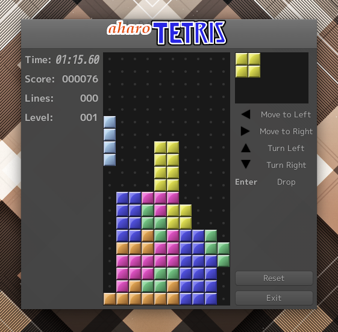

AhoRis
====================================================================================================
“アホリス”といいつつ、取り立ててアホでもない普通のテトリス。

GTK+3を使用したLinux用のデスクトップアプリケーションですが最近はWindowsでもGTKのアプリを起動できるら
しい(動作未確認)です。

このテトリスは「連鎖反応」ができるようになっています。  
つまりある行を消して落ちてくる上のブロックがその下の行を消すことがあるという機能です。  
私が子供のころに遊んだテトリスがそういう機能があったと思うのですが、今Youtubeなどでプレイ動画を
見るとそういう機能はなさそうです。  
「ぷよぷよ」と記憶が混ざったか、マンデラ効果というやつでしょうか。  
ひょっとしたらこれはテトリスの公式ルールでは禁止されているのかもしれません。  
もしそうだったら、「こんなのテトリスじゃない!」と怒られそうで少し緊張します。  
しかし連鎖反応があると楽しみが増えると思いますのでその点はご容赦ください。

テトリスの歴史
----------------------------------------------------------------------------------------------------
> 元々はソビエト連邦（現・ロシア）の科学者アレクセイ・パジトノフ（Алексей
> Леонидович Пажитнов、ラテン文字転写Alexey Leonidovich Pajitnov）など3人が教育用
> ソフトウェアとして開発した作品である。1984年6月6日に初めてプレイ可能な版が開発された[1]後、様々な
> ゲーム制作会社にライセンス供給され、各種のプラットフォーム上で乱立する状態になった。

-- Wikipedia より

Wikipediaに記載されていない点を補足すると、テトリスは非常に中毒性の高いゲームであるが、
これは実は冷戦時代のソ連がアメリカの国力を落とす目的でそのようにしたという説が巷では定説となっている。

その説が本当だとすれば、このプログラミングの難しさもなるほど納得であるが、実際には中毒性が知られるよ
うになってから色々陰謀に使われるようになったというのが近いでしょう。

得点
----------------------------------------------------------------------------------------------------
このアプリの得点ルールは以下の表の通りになります。

| 条件                     | 得点       |
|--------------------------|------------|
| 一行消し (シングル)      | 40         |
| 二行消し (ダブル)        | 100        |
| 三行消し (トリプル)      | 300        |
| 四行消し (テトリス)      | 1200       |
| 五行以上                 | 2000×行数 |
| シングルとダブル同時     | 1000       |
| 二つのシングル(一行開け) | 600        |
| 二つのシングル(二行開け) | 900        |

※連鎖一回ごとに倍数で得点できます。

まあ間違ってたらスイマセン。

ライセンス
----------------------------------------------------------------------------------------------------
昔、任天堂とセガが独占販売権を巡って激しく争った歴史があるので、ライセンス関係は色々地雷らしいですが、
ネット上には模造品が山ほど転がっているし、商用利用していないので大丈夫に違いありません。

ロゴのデザインにも決まりがあるらしいですな。
必要かどうかわかりませんが、適切に判断した上でいつか対応するかもしれません。

ビルド方法
----------------------------------------------------------------------------------------------------
普通にmesonビルドシステムを利用してビルドします。

    $ meson --prefix=/usr/local build
	$ cd build
	$ ninja
	$ sudo ninja install

AppImage
----------------------------------------------------------------------------------------------------
すぐに実行可能なAppImageは以下のリンクからダウンロード可能でありやす。

[リリースページ](https://github.com/aharotias2/ahoris/releases)

----------------------------------------------------------------------------------------------------

Copyright (C) 2021 田中喬之
